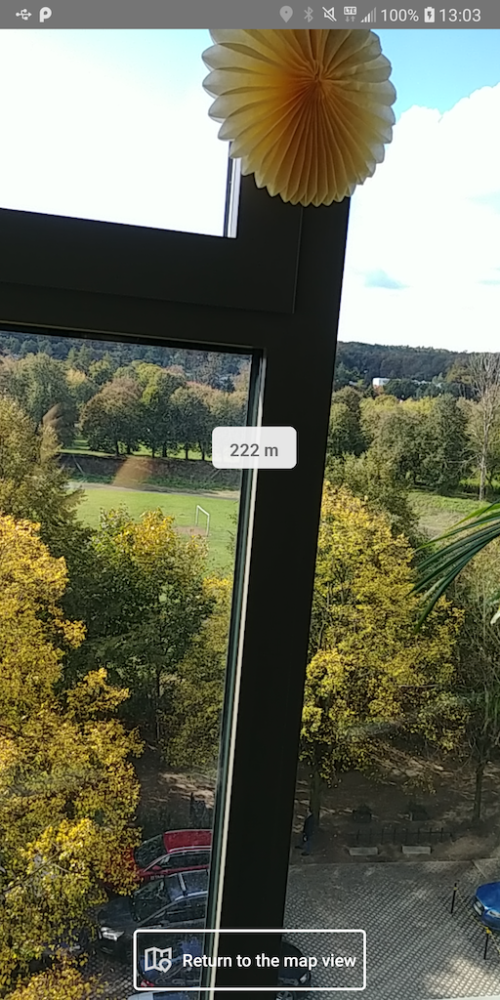
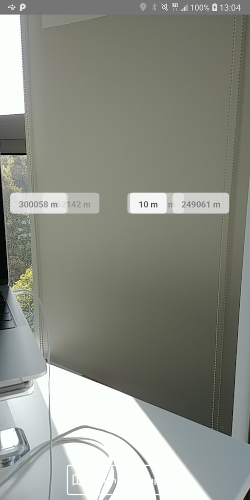

[](https://app.bitrise.io/app/02902760b64f29d8)
[](https://dependabot.com)

# Ar Localizer - alternative(without ARCore)

Library that displays chosen locations distances on a camera preview. 

## Building
<!-- Aim to explain the process so that any new or external developer not familiar with the project can perform build and deploy -->

### Build types
<!-- List and describe build types -->
#### debug
 - debuggable
 - disabled ProGuard
 - uses built-in shrinking (no obfuscation)
 
#### release
 - uses full ProGuard configuration
 - enables zipAlign, shrinkResources
 - non-debuggable

### Building the sample app
<!-- List all build properties that have to be supplied, including secrets. Describe the method of supplying them, both on local builds and CI -->

Build properties needed to build the sample app. The library itself doesn't need any API keys. 
You need to provide api key in secret.properties file. 

| Property            | External property name | Environment variable |
|---------------------|------------------------|----------------------|
| Google Maps API key | GoogleMapsApiKey       | GOOGLE_MAPS_API_KEY  |

## Using library
<!-- description of steps how to implement the library -->

1. Add repository in you projects build.gradle file 
   
    ```gradle
    repositories {
        maven {  url 'https://dl.bintray.com/netguru/maven/' }
        ...
    }
    ```
    
2. Add library dependency 

    ```gradle
        dependencies {
                implementation 'com.netguru.arlocalizer:arlocalizer:0.1.0'
        }
    ```
    
3. Add view to your layout

    ```xml
     <co.netguru.arlocalizer.arview.ARLocalizerView
            android:id="@+id/arLocalizer"
            android:layout_width="match_parent"
            android:layout_height="match_parent"
            />
    ``` 
        
4. You need to provide

    ```kotlin
    interface ARLocalizerDependencyProvider {
        fun getSensorsContext(): Context
        fun getARViewLifecycleOwner(): LifecycleOwner
        fun getPermissionActivity(): Activity
    }
    ```      
    
   in arLocalizerView onCreate method
        
    ```kotlin
    arLocalizerView.onCreate(arLocalizerDependencyProvider: ARLocalizerDependencyProvider)
    ```

5. In order to process the permission request you need to provide permission results to the view.

    ```kotlin
        fun onRequestPermissionResult(
            requestCode: Int,
            permissions: Array<out String>,
            grantResults: IntArray
        )
    ```    
    
6. Finally in order to display the destination labels on the camera preview use

    ```kotlin
    arLocalizerView.setDestinations(destinations: List<LocationData>)
    ```
    
</img> </img> </img>
